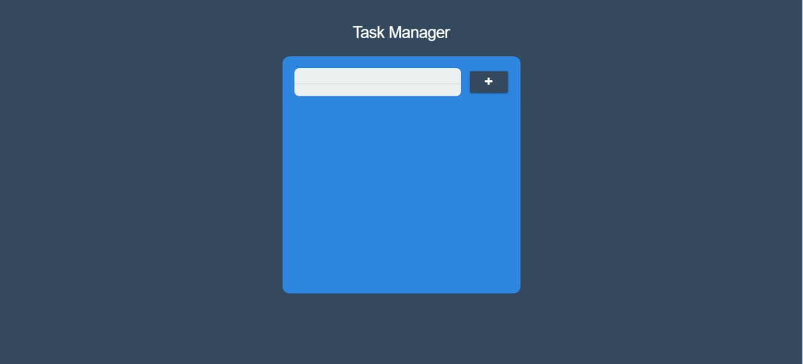

# Task_Manager_Web
> Seu Aplicativo Web de ToDo List Para Organizar Sua Tarefas.

# :paperclip: Histórico de Versões

* 0.2.1
    * Interface Beta
    * Armazenamento no LocalStorage;
    * Criação e Remoção Dinamica de Notas Via JavaScript
    * Splash Screen

***

* 1.0.1 
    * Nova Interface Responsiva
    * Novo Design e Nova SplashScreen

***
# 📝 License

Este projeto está licenciado sob a Licença MIT - consulte o arquivo [LICENÇA](LICENSE) para obter detalhes.

***

Feito com 💜 &nbsp;por Miguel Henrique 👋
